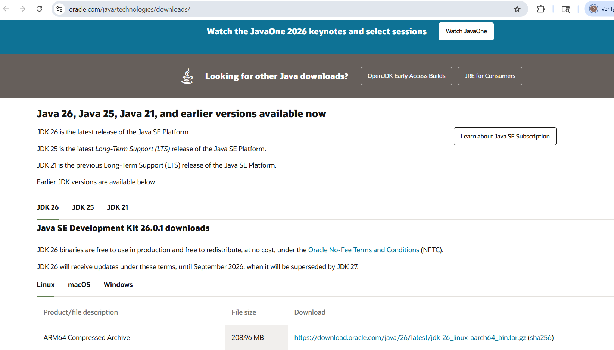
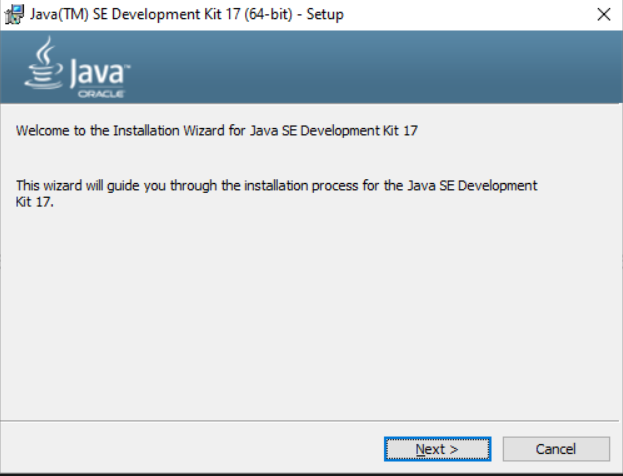
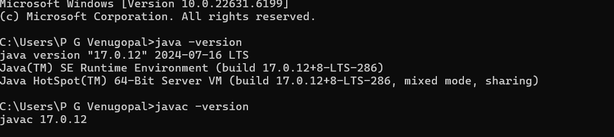
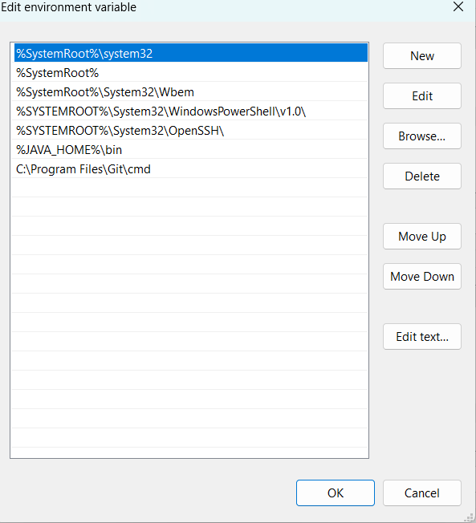

# Setup_Instructions.md

## MediTrack – Java Setup Guide (With Screenshots)

---

## 1. Download Java JDK

### Step:

* Go to the official Java download website
* Download the latest JDK (Java Development Kit)

### Screenshot:



---

## 2. Install JDK

### Step:

* Run the downloaded installer
* Click **Next → Next → Finish**

### Screenshot:



---

## 3. Verify Installation

Open Command Prompt / Terminal and run:

```
java -version
javac -version
```

### Expected Output:

* Displays installed Java version

### Screenshot:



---

## 4. Set JAVA_HOME Environment Variable

### Windows Steps:

1. Open **System Properties**
2. Go to **Advanced → Environment Variables**
3. Click **New** under System Variables

**Variable Name:**

```
JAVA_HOME
```

**Variable Value:**

```
C:\Program Files\Java\jdk-<version>
```

### Screenshot:


---

## 5. Update PATH Variable

### Step:

* Edit `Path` variable
* Add:

```
%JAVA_HOME%\bin
```

### Screenshot:



---

## 6. Verify Environment Variables

Run:

```
echo %JAVA_HOME%
```

### Screenshot:


---


## Setup Complete ✅

Java is successfully installed and configured .
